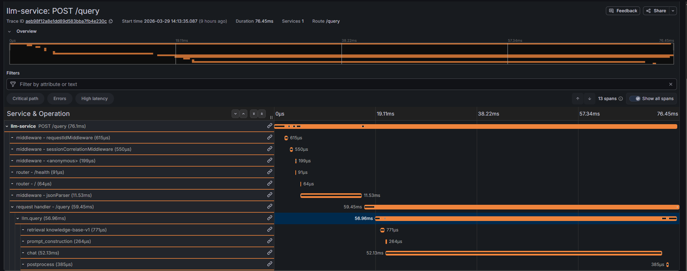
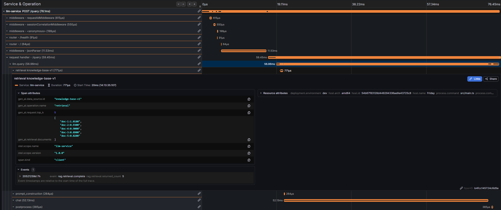
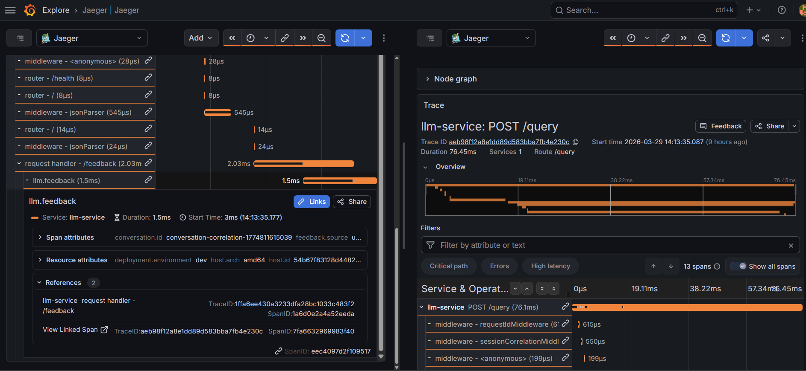

# The Complete Guide to LLM Observability with OpenTelemetry

*How to instrument a real-world GenAI application with traces, metrics, and correlated logs, using a hands-on Node.js project.*

---

I built this project to teach myself OpenTelemetry properly. I had read the official docs, watched a few talks, and still felt like I was missing the practical side — how does it actually fit together in a real application? So I built a small but complete LLM service and instrumented every part of it from scratch.

This article is what I wish I had found when I started. It walks through every pattern I used, why I made those choices, and what the output looks like in Jaeger and Grafana.

If you are building applications powered by LLMs, you have likely run into this problem in production: something goes wrong and you have no idea *where* in your pipeline it broke, *how long* each step took, or *how much* that failed request just cost you.

Traditional APM tools were not designed for LLM workloads. Token counts, retrieval quality, retry loops with exponential backoff — these are new dimensions that need purpose-built observability.

This guide walks you through building production-grade LLM observability from scratch using **OpenTelemetry** (OTel). Every pattern shown here comes from a working open-source project you can clone and run locally.

> **Language note:** The code examples are in **TypeScript** (Node.js), but every concept and pattern translates directly to Python, Go, Java, or any other language with an OTel SDK. The ideas are language-agnostic; the syntax isn't.

**GitHub repo:** [llm-observability](https://github.com/vpr1995/llm-observability)

---

## What You'll Learn

Bootstrapping OTel, creating parent-child span trees, recording LLM-specific metrics (tokens, cost, retries), correlating logs with traces, linking feedback to queries via span links, and setting up the full observability stack (Jaeger + Prometheus + Grafana + Loki). Plus privacy-aware instrumentation with PII redaction.

---

## But First: What Are Traces, Spans, and Metrics?

Before diving into code, let's demystify the jargon. If you've never touched OpenTelemetry, this section is for you.

### Observability vs. Monitoring

**Monitoring** is like having a smoke alarm, telling you *something is wrong*. **Observability** is like having security cameras, smoke detectors, and motion sensors, telling you *what went wrong, where, and why*.

For LLM apps, monitoring says "requests are slow." Observability says "requests are slow because the retrieval step is taking 3 seconds and the LLM is retrying twice due to rate limits."

### Traces: The Full Story of a Request

Imagine ordering food through a delivery app: restaurant receives it → chef cooks it → rider picks it up → rider delivers it. A **trace** is the complete journey of that order from start to finish, with a unique **trace ID** (like your order number).

In our app, a user query travels through retrieval → prompt building → LLM call → post-processing. The trace captures this entire journey as one unit.

### Spans: The Individual Steps

Each step in the journey is a **span**. Each span knows *when* it started and ended, *who* its parent is, *what* happened (via attributes and events), and *whether* it succeeded.

Spans nest into a tree; child spans run inside their parent:

```
llm.query (parent span)
├── retrieval knowledge-base-v1  (child span)
├── prompt_construction          (child span)
├── chat                         (child span)
└── postprocess                  (child span)
```

### Attributes: Labels on Your Spans

**Attributes** are key-value pairs attached to a span, think of them as sticky notes. In our LLM app:

- `gen_ai.request.model = "gpt-4o-mini"`
- `gen_ai.usage.input_tokens = 1250`
- `gen_ai.usage.estimated_cost_usd = 0.003`
- `error.type = "rate_limit"`

They let you filter in Jaeger: "show me all traces where `error.type = rate_limit`", across thousands of requests.

### Events: Things That Happened *During* a Span

If attributes describe *what* a span is, **events** describe *what happened* while it was running. They're timestamped entries inside a span, like a mini changelog.

In our LLM app:
- `gen_ai.prompt.sent`: prompt was dispatched to the model
- `gen_ai.response.received`: model replied with 450 tokens
- `gen_ai.retry`: got a 429, retrying in 2.5 seconds

In Jaeger these appear as discrete dots on the span timeline, making it easy to pinpoint *when* a failure or retry occurred.

### Metrics: The Numbers Across All Requests

A trace tells you what happened to *one* request. **Metrics** tell you what's happening across *all* of them.

Think of it like the difference between a patient's medical chart (one trace) and a hospital dashboard showing "42 patients admitted today, average wait time 23 min, 3 critical cases" (metrics).

Three metric types you'll use:
- **Counter**: only goes up. "How many requests total?" `gen_ai.request.count`
- **Histogram**: tracks distributions. "What's the p95 latency? The p99 token count?" `gen_ai.client.token.usage`
- **UpDownCounter**: goes up and down. "How many LLM calls are in flight *right now*?" `gen_ai.client.active_requests`

### Logs: The Human-Readable Play-by-Play

Logs are the narrative: `"Query received, length=42, topK=3"`. On their own they're useful but isolated. The key upgrade: inject `trace_id` and `span_id` into every log line; then you can click a log entry in Grafana and jump straight to the matching trace in Jaeger.

### Baggage: Context That Travels Automatically

**Baggage** is like a label attached to a package. Once you attach `session.id = "sess-001"` to the current context, every child span created anywhere downstream can read it without you passing it manually. OTel handles the propagation.

### Span Links: Connecting Related but Separate Traces

Sometimes two operations are related but *not* parent-child. A user rates an answer 30 minutes after asking; these are separate requests with separate trace IDs, but you want to connect them.

**Span links** are like cross-references in a book: "for the original question, see trace abc123." The feedback trace stands alone but carries a pointer back to the query trace.

---

Now that we have the vocabulary, let's build it.

---

## The Architecture

The application implements a simplified RAG (Retrieval-Augmented Generation) pipeline exposed via a REST API:

```
POST /query
  → Retrieve relevant documents
  → Build a prompt from query + documents
  → Call the LLM
  → Post-process the response

POST /feedback
  → Linked back to the original /query trace via span links
```

Each step is wrapped in its own **span**, forming a trace tree:

```
llm.query
├── retrieval knowledge-base-v1
├── prompt_construction
├── chat
└── postprocess
```


*Grafana trace view for a single /query request. The `llm.query` parent span (56.96ms total) nests the four pipeline child spans — retrieval, prompt_construction, chat, postprocess — along with the auto-instrumented Express middleware spans above.*

The observability stack consists of:

| Component    | Purpose                     | Port  |
|-------------|----------------------------|-------|
| **Jaeger**  | Distributed trace visualization | 16686 |
| **Prometheus** | Metrics scraping & storage | 9090  |
| **Grafana** | Dashboards & alerting       | 3001  |
| **Loki**    | Log aggregation             | 3100  |

---

## Step 1: Bootstrap OpenTelemetry - The "Import First" Rule

**OpenTelemetry instrumentation must be initialized before your application code loads.** If you import Express before OTel patches it, auto-instrumentation won't work. Think of it like setting up security cameras *before* the store opens.

```typescript
// src/main.ts - entry point
import './observability/instrumentation';  // ← Must be FIRST
import { startServer } from './app';

startServer();
```

The instrumentation file sets up the entire telemetry pipeline:

```typescript
// src/observability/instrumentation.ts
import { NodeSDK } from '@opentelemetry/sdk-node';
...

const sdk = new NodeSDK({
  resource: resourceFromAttributes({
    'service.name': 'llm-service',
    'service.version': '1.0.0',
    'deployment.environment': 'development',
  }),
  traceExporter: new OTLPTraceExporter({
    url: `${otelEndpoint}/v1/traces`,
  }),
  metricReaders: [
    new PeriodicExportingMetricReader({
      exporter: new OTLPMetricExporter({ url: `${otelEndpoint}/v1/metrics` }),
      exportIntervalMillis: 10000,
    }),
    new PrometheusExporter({ port: 9464 }),  // Scrape endpoint
  ],
  instrumentations: [
    getNodeAutoInstrumentations({
      '@opentelemetry/instrumentation-http': {
        // Don't trace health checks - they add noise
        ignoreIncomingRequestHook: (req) =>
          req.url?.startsWith('/health') ?? false,
      },
    }),
  ],
});
```

### What This Gets You for Free

`getNodeAutoInstrumentations()` automatically creates spans for HTTP requests, Express routes, and Node.js core operations. That's the skeleton. The real value is **manual instrumentation**, adding LLM-specific context on top.

### Custom Histogram Buckets

Default OTel bucket boundaries are tuned for HTTP latency (0.005s, 0.01s...). Token counts run from 1 to 65,000 and costs from $0.001 to $100, very different distributions. Always define custom boundaries:

```typescript
views: [
  {
    instrumentName: 'gen_ai.client.token.usage',
    instrumentType: InstrumentType.HISTOGRAM,
    aggregation: {
      type: AggregationType.EXPLICIT_BUCKET_HISTOGRAM,
      options: {
        boundaries: [1, 4, 16, 64, 256, 1024, 4096, 16384, 65536],
      },
    },
  },
  {
    instrumentName: 'gen_ai.request.cost.usd',
    instrumentType: InstrumentType.HISTOGRAM,
    aggregation: {
      type: AggregationType.EXPLICIT_BUCKET_HISTOGRAM,
      options: {
        boundaries: [0.001, 0.01, 0.1, 1, 10, 100],
      },
    },
  },
]
```

### Graceful Shutdown

Telemetry data is batched and exported periodically. If your process exits abruptly, you lose the last batch. Always handle shutdown signals:

```typescript
const signalHandler = () => {
  void sdk.shutdown();  // Flushes pending exports
};

process.once('SIGTERM', signalHandler);
process.once('SIGINT', signalHandler);
```

---

## Step 2: The Span Lifecycle Helper

Managing spans manually is error-prone; forgetting `span.end()`, swallowing errors, or failing to propagate context are common bugs. We solve this with a single helper:

```typescript
// src/observability/span.ts
export const withActiveSpan = async <T>(
  options: ActiveSpanOptions,
  callback: (span: Span) => Promise<T> | T,
): Promise<T> => {
  // Read baggage so child spans inherit session/request context automatically
  const baggage = propagation.getBaggage(context.active());
  const baggageAttributes = extractBaggageAttributes(baggage);

  return tracer.startActiveSpan(
    options.name,
    { kind: options.kind, attributes: { ...baggageAttributes, ...options.attributes }, links: options.links },
    async (span) => {
      try {
        return await callback(span);
      } catch (error) {
        const appError = toAppError(error);
        options.onError ? options.onError(appError, span) : recordSpanError(span, appError);
        throw appError;
      } finally {
        span.end();  // Always runs - even on error
      }
    },
  );
};
```

Every pipeline stage uses this wrapper. Errors are always recorded, spans are always closed, and session context flows automatically.

### Error Recording

```typescript
export const recordSpanError = (span: Span, error: unknown): AppError => {
  span.recordException(appError);  // Stack trace visible in Jaeger
  span.setStatus({ code: SpanStatusCode.ERROR, message: appError.message });
  span.setAttribute('error.type', appError.errorType);  // Filterable in queries
  return appError;
};
```

The span turns red in Jaeger, the stack trace is attached, and `error.type` lets you filter across traces.

---

## Step 3: Decorating Pipeline Stages with Spans

With `withActiveSpan` as the foundation, we create two ergonomic wrappers:

### Function Wrapper: `traced()`

For standalone functions (most common in a pipeline):

```typescript
// src/decorators/traced.ts
export function traced<F extends (...args: any[]) => any>(
  spanName: string,
  options: TracedOptions,
  fn: F,
): (...args: Parameters<F>) => Promise<Awaited<ReturnType<F>>> {
  return (...args) =>
    withActiveSpan({ name: spanName, ...options }, () => fn(...args));
}
```

Usage in the retriever:

```typescript
// src/pipeline/retriever.ts
export const retrieveDocuments = traced(
  'retrieval knowledge-base-v1',
  {
    kind: SpanKind.CLIENT,
    attributes: {
      'gen_ai.operation.name': 'retrieval',
      'gen_ai.data_source.id': 'knowledge-base-v1',
    },
    onError: (error, span) => recordSpanError(span, error),
  },
  _retrieveDocuments,  // The actual implementation
);
```



*The `retrieval knowledge-base-v1` span in Jaeger showing the custom attributes set by the `traced()` wrapper: `gen_ai.data_source.id`, `gen_ai.request.top_k`, and the retrieved documents with relevance scores. The `rag.retrieval.complete` span event is visible at the bottom — exactly what you defined in code, now visible as live trace data.*

### Class Method Decorator: `@Traced()`

For class-based services (like the LLM client):

```typescript
// src/pipeline/llmClient.ts
class LlmClient {
  @Traced('chat', {
    kind: SpanKind.CLIENT,
    onError: (error, span) => recordSpanError(span, error),
  })
  public async generateResponse(options: LLMGenerateOptions): Promise<LlmResponse> {
    // Inside here, trace.getActiveSpan() returns the 'chat' span
    const span = trace.getActiveSpan();
    span?.setAttribute('gen_ai.request.model', this.model);
    // ...
  }
}
```

Both approaches delegate to the same `withActiveSpan` lifecycle, giving you consistency without boilerplate.

The intent here is deliberate: **instrumentation should never bleed into business logic.** The retriever's job is to fetch documents; it shouldn't be littered with `span.start()` / `span.end()` calls. `traced()` and `@Traced()` keep the observability concern entirely at the boundary, so the inner function stays readable and testable on its own. Only reach inside a span (via `trace.getActiveSpan()`) when you genuinely need to attach domain-specific context that only the inner logic knows about.

---

## Step 4: Instrumenting the LLM Client (The Complex One)

The LLM client is where observability pays for itself. It's the most expensive, most fallible part of the pipeline, and the most important to instrument well. It tracks span events, token usage, cost, retries, and concurrency.

### Span Events: Timestamped Entries Inside the Span

```typescript
// Before calling the LLM
span?.addEvent('gen_ai.prompt.sent', {
  'gen_ai.prompt.estimated_tokens': Math.ceil(prompt.length / 4),
  'retry.attempt': attempt,
});

// After receiving the response
span?.addEvent('gen_ai.response.received', {
  'gen_ai.usage.input_tokens': usage.inputTokens,
  'gen_ai.usage.output_tokens': usage.outputTokens,
  'gen_ai.response.finish_reasons': finishReasons.join(','),
});
```

In Jaeger, these appear as discrete points on the span timeline; you can see exactly when the prompt was sent and how long the model took to respond.

### Retry Logic with Observability

Every retry is recorded as a span event so you have a full audit trail:

```typescript
for (let attempt = 1; attempt <= maxAttempts; attempt++) {
  try {
    // ... make LLM call
    return response;
  } catch (error) {
    if (!isRetryable || attempt === maxAttempts) throw error;
    
    const delay = getRetryDelay(attempt);
    // Base delay * 2^(attempt-1) + random jitter (0-250ms)
    
    span?.addEvent('gen_ai.retry', {
      'retry.attempt': attempt,
      'retry.delay_ms': delay,
      'error.type': error.errorType,
    });
    
    recordRetryCount({ 'error.type': error.errorType });
    
    await sleep(delay);
  }
}
```

### Cost Tracking

```typescript
const estimatedCostUsd =
  (inputTokens / 1_000_000) * inputPricePerMToken +
  (outputTokens / 1_000_000) * outputPricePerMToken;

span?.setAttribute('gen_ai.usage.estimated_cost_usd', estimatedCostUsd);
recordRequestCost(estimatedCostUsd, attributes);
```

Set a Grafana alert when p95 cost per request exceeds your budget. In my experience, cost tracking surfaces unexpected behavior faster than most other signals — a prompt change that doubled token usage, a retry storm that ran up the bill overnight.

### Concurrency Monitoring

```typescript
incrementActiveRequests(attributes);  // +1 when call starts
try {
  // ... LLM call
} finally {
  decrementActiveRequests(attributes);  // -1 when done
}
```

This gives you a real-time gauge of concurrent LLM calls, critical for capacity planning and detecting pile-ups under load.

---

## Step 5: Defining LLM-Specific Metrics

The five metrics that matter most for LLM applications:

```typescript
// src/observability/meter.ts
const meter = metrics.getMeter('llm-service', '1.0.0');

meter.createHistogram('gen_ai.client.token.usage',      { unit: 'tokens' });  // Token burn rate
meter.createHistogram('gen_ai.client.operation.duration', { unit: 's' });     // End-to-end latency
meter.createCounter('gen_ai.request.retry.count');                            // Rate-limit pressure
meter.createHistogram('gen_ai.request.cost.usd',        { unit: 'usd' });     // Spend tracking
meter.createHistogram('gen_ai.feedback.rating');                              // User satisfaction
```

### Dimensions Matter

Always pass attributes when recording metrics; they're what make dashboards useful:

```typescript
recordTokenUsage(inputTokens, {
  'gen_ai.provider.name': 'openai',
  'gen_ai.request.model': 'gpt-4o-mini',
  'gen_ai.token.type': 'input',  // Lets you split input vs. output
});
```

This unlocks Grafana queries like p95 latency by model, error rate by type, or token cost broken down by session.

---

## Step 6: Correlating Logs with Traces

Logs and traces are two views of the same story. The trick is linking them with `trace_id` and `span_id`:

```typescript
// src/utils/logger.ts - Pino logger with OTel mixin
const logger = pino({
  mixin(_context, level) {
    const activeSpan = trace.getActiveSpan();
    const spanContext = activeSpan?.spanContext();
    return {
      trace_id: spanContext?.traceId,
      span_id: spanContext?.spanId,
      severity_number: pinoLevelToSeverityNumber(level),
    };
  },
});
```

Every log line automatically includes the trace and span IDs of the currently active span. In Grafana, you can click a log line and jump directly to the corresponding trace in Jaeger.

### Structured Child Loggers

Create child loggers per request so every downstream log line inherits session context:

```typescript
req.logger = getLogger({ 'request.id': requestId })
  .child({ 'session.id': sessionId, 'conversation.id': conversationId });
```

Logs are shipped to Loki via Promtail, which extracts `trace_id` and `span_id` as labels. This completes the three pillars: **traces, metrics, and logs**, all connected by the same IDs.

---

## Step 7: Session and Conversation Propagation

Middleware reads `X-Session-ID` / `X-Conversation-ID` headers (or generates them) and stores them in OTel baggage:

```typescript
const baggage = propagation.createBaggage({
  'request.id': { value: req.requestId },
  'session.id': { value: sessionId },
  'conversation.id': { value: conversationId },
});

context.with(propagation.setBaggage(context.active(), baggage), () => next());
```

That's it. Because `withActiveSpan` always reads baggage, every child span (retrieval, prompt building, chat) gets these IDs automatically. The retriever doesn't know what a session is; it just appears on its span.

---

## Step 8: Span Links - Connecting Feedback to Queries

When a user rates an answer, you want to connect the feedback trace to the original query, but *not* share a trace ID. They're separate operations.

**Watch out:** sending the query's `traceparent` in the standard header causes OTel's HTTP auto-instrumentation to adopt it as the parent, merging the two traces. Instead, use a **custom header** (`X-Linked-To`) and create an explicit span link:

### Custom Header + Span Link

```typescript
// Client sends: X-Linked-To: 00-<traceId>-<spanId>-01
// (NOT traceparent - that would be auto-adopted)

// Middleware parses it
const linkedSpanContext = parseLinkedTraceparent(req.header('X-Linked-To'));
if (linkedSpanContext) {
  req.linkedSpanContext = linkedSpanContext;
}
```

```typescript
// src/routes/feedback.ts - creating the span link
const links: Link[] = req.linkedSpanContext
  ? [{
      context: req.linkedSpanContext,
      attributes: {
        'link_type': 'feedback_to_query',
        'request.id': originalRequestId,
      },
    }]
  : [];

await withActiveSpan({
  name: 'llm.feedback',
  kind: SpanKind.INTERNAL,
  links,  // ← Creates a FOLLOWS_FROM reference in Jaeger
  attributes: {
    'gen_ai.feedback.rating': rating,
    'gen_ai.feedback.accuracy': accuracy,
  },
}, async (span) => {
  // Record feedback metrics
  recordFeedbackCount(attributes);
  if (rating) recordFeedbackRating(rating, attributes);
  if (accuracy !== undefined) recordAccuracyCount(attributes);
});
```

In Jaeger this shows as a **FOLLOWS_FROM** link. Click it and you jump from the feedback trace to the original query. Now you can answer: "What was the query that got a 1-star rating?"


*The `llm.feedback` span (left) with two entries under "References". Clicking "View Linked Span" navigates directly to the original `/query` trace (right). Two completely separate trace IDs, one navigable connection — this is the span link pattern in action.*

---

## Step 9: Privacy-Aware Instrumentation

User queries can contain PII. Add a redaction layer that cleans content *before* it enters your traces:

```typescript
const PII_PATTERNS = [
  /\d{3}-\d{2}-\d{4}/g,          // SSN
  /[\w.]+@[\w.]+\.[a-z]{2,}/g,   // Email
  /\(?\d{3}\)?[\s.-]\d{3}[\s.-]\d{4}/g,  // Phone
];
```

When redaction fires: the content is cleaned, a `gen_ai.content.filtered` span event is recorded (audit trail), and `gen_ai.content.filtered = true` is set as a span attribute. Incoming and outgoing redaction are independently configurable.

---

## Step 10: Structured Error Handling

Classify every error so it flows cleanly into span attributes and metric dimensions:

```typescript
class AppError extends Error {
  constructor(
    message: string,
    public statusCode: number,
    public errorType: string,   // 'timeout' | 'rate_limit' | 'retriever_error' | ...
    public isRetryable: boolean,
  ) { super(message); }
}
```

The `errorType` becomes a span attribute *and* a metric dimension; so you can graph error rate by type, correlate retries with rate-limit spikes, and filter traces by exact failure cause.

---

## Step 11: The Observability Infrastructure

The entire stack runs with a single `docker compose up -d`:

```yaml
services:
  jaeger:     # Traces UI (16686) + OTLP receiver (4317/4318) + span metrics (8889)
  prometheus: # Scrapes jaeger:8889 and app:9464
  loki:       # Log aggregation
  grafana:    # Dashboards - auto-provisioned with datasources and a starter dashboard
```

The project ships a pre-built Grafana dashboard with six panels: request throughput, error rate by type, p95 latency, token usage, retrieval duration, and feedback ratings. Everything is wired up automatically: datasources, dashboard provisioning, the works.

---

## Step 12: Semantic Conventions - Consistent Attribute Names

Define all attribute names in one place and import them everywhere. OTel's emerging GenAI conventions give you a head start:

```typescript
export const ATTRS = {
  GEN_AI_OPERATION_NAME:       'gen_ai.operation.name',
  GEN_AI_REQUEST_MODEL:        'gen_ai.request.model',
  GEN_AI_USAGE_INPUT_TOKENS:   'gen_ai.usage.input_tokens',
  GEN_AI_USAGE_OUTPUT_TOKENS:  'gen_ai.usage.output_tokens',
  GEN_AI_USAGE_ESTIMATED_COST: 'gen_ai.usage.estimated_cost_usd',
  SESSION_ID:                  'session.id',
  RETRY_ATTEMPT:               'retry.attempt',
  // ... ~70 total
};
```

No more debating `token_count` vs `tokens` vs `num_tokens` across teams. One file, one source of truth.

---

## Running It Yourself

```bash
# 1. Clone the repo
git clone https://github.com/vpr1995/llm-observability.git
cd llm-observability

# 2. Start the observability stack
docker compose up -d

# 3. Install dependencies and run the app
npm install
npm run dev

# 4. Send a query
curl -s http://localhost:3000/query \
  -H 'Content-Type: application/json' \
  -H 'X-Session-ID: sess-001' \
  -H 'X-Conversation-ID: conv-001' \
  -d '{"query":"What is OpenTelemetry?","topK":3}' | jq

# 5. Open Jaeger at http://localhost:16686 and search for service "llm-service"
```

You'll see the full span tree with all attributes, events, and timing.

### Try the Feedback Flow

```bash
# Use the traceparent from the query response
curl -s http://localhost:3000/feedback \
  -H 'Content-Type: application/json' \
  -H 'X-Session-ID: sess-001' \
  -H 'X-Linked-To: <TRACEPARENT_FROM_QUERY_RESPONSE>' \
  -d '{"requestId":"<REQUEST_ID>","rating":5,"accuracy":true,"comment":"Very helpful!"}' | jq
```

In Jaeger, the feedback span will show a **FOLLOWS_FROM** link back to the query trace.

---

## Key Takeaways

1. **Initialize OTel first.** `import './instrumentation'` must be the very first line.
2. **Build a span lifecycle helper.** One function that handles start, baggage, error recording, and guaranteed `span.end()`.
3. **Use decorators for pipeline stages.** `traced()` / `@Traced()` keep observability out of business logic.
4. **Define semantic conventions early.** Consistent attribute names are what make multi-service dashboards possible.
5. **Track LLM-specific metrics.** Token usage, cost, retry rate, and user ratings are the core four.
6. **Correlate logs with trace IDs.** One mixin, every log line, and logs become navigable.
7. **Span links, not parent-child, for cross-request correlation.** Separate trace IDs, explicit link.
8. **Test your instrumentation in CI.** In-memory exporters let you assert on span trees and attributes like any other code.

---

## What's Next?

Once you have the fundamentals in place, consider:

- **Streaming token instrumentation**: track tokens as they arrive, not just at completion
- **Prompt versioning**: add `gen_ai.prompt.version` to compare prompt performance
- **A/B experiment tracing**: add experiment variant attributes for model comparison
- **SLO-based alerting**: set Grafana alerts on p99 latency and error budget burn rate
- **Multi-model routing observability**: trace model selection decisions and fallback chains

---

*The full source code is available on [GitHub](https://github.com/vpr1995/llm-observability). Clone it, run it, adapt it to your own stack.*

*If this guide was useful, share it with your team. Observability works best when everyone on the team instruments their code consistently.*

---

**Tags:** `#OpenTelemetry` `#LLM` `#Observability` `#NodeJS` `#RAG` `#GenAI` `#Jaeger` `#Prometheus` `#Grafana`
